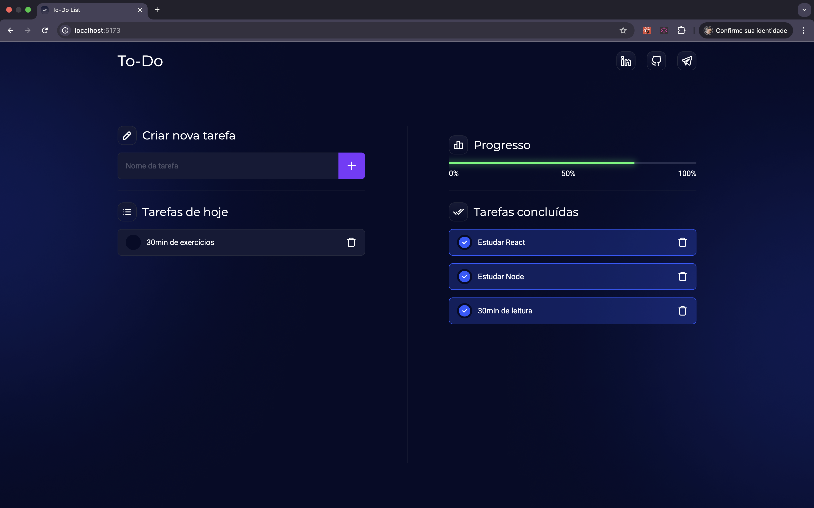

# To-Do

Aplicação simples de **lista de tarefas** (to-do) construída com **TypeScript** e empacotada com **Vite**. Ideal para praticar conceitos de estado, manipulação do DOM e organização de componentes/arquivos em uma SPA.

> 🔗 **Demo:** [https://to-do-tawny-gamma.vercel.app/](https://to-do-tawny-gamma.vercel.app/)



---

## ⚙️ Tecnologias & principais arquivos

- **Vite** (build/dev server) — configuração em `vite.config.ts`
- **TypeScript** — configurações em `tsconfig.json` e `tsconfig.node.json`
- HTML estático inicial em `index.html`
- Código-fonte em `src/`
- Gerenciador de pacotes: o projeto possui `yarn.lock` (você pode usar Yarn, PNPM ou NPM; veja abaixo)

> Dica: Caso esteja usando outro gerenciador, remova o arquivo de lock anterior para evitar conflitos.

---

## 🧰 Pré-requisitos

- **Node.js** 18+ (recomendado)  
- **Gerenciador de pacotes** à sua escolha:
  - Yarn `>=1.22`
  - PNPM `>=9`
  - NPM `>=9`

---

## 🚀 Como rodar localmente

Clone o repositório e instale as dependências:

```bash
git clone https://github.com/carlosdancr/to-do.git
cd to-do

# escolha um:
yarn           # ou
pnpm install   # ou
npm install
```

Inicie o servidor de desenvolvimento:

```bash
# escolha um:
yarn dev       # ou
pnpm dev       # ou
npm run dev
```

A aplicação geralmente sobe em `http://localhost:5173` (porta padrão do Vite).

---

## 🏗️ Build de produção

Gere os arquivos otimizados:

```bash
# escolha um:
yarn build     # ou
pnpm build     # ou
npm run build
```

Pré-visualize o build localmente:

```bash
# escolha um:
yarn preview   # ou
pnpm preview   # ou
npm run preview
```

Os artefatos finais ficarão em `dist/`.

---

## 📦 Estrutura de pastas (resumo)

```
to-do/
├─ src/                # código-fonte da aplicação
├─ index.html          # HTML base
├─ vite.config.ts      # config do Vite
├─ tsconfig.json       # config TypeScript do app
├─ tsconfig.node.json  # config TS para ferramentas
├─ to-do.png           # screenshot usado no README
├─ custom.d.ts         # declarações TS auxiliares (se necessário)
└─ yarn.lock           # lockfile (caso use Yarn)
```

> Observação: o conteúdo exato de `src/` pode variar; consulte os arquivos para descobrir a organização de componentes e utilitários.

---

## 🌐 Deploy

Este projeto já tem um deploy público na **Vercel** (link na seção “Demo”). Para fazer o seu próprio:

1. **Importe o repositório** na Vercel.
2. **Framework Preset:** “Vite”.
3. **Comando de build:** `vite build` (ou o script do `package.json`).
4. **Diretório de saída:** `dist`.

---

## 🤝 Contribuição

- Faça um fork, crie uma branch e abra um PR.
- Siga um padrão de commits (ex.: Conventional Commits) e tente manter mudanças pequenas e focadas.
- Inclua prints/descrições claras para mudanças visuais.

---

## 📝 Licença

No momento, **não há um arquivo de licença** definido no repositório.  
Se desejar abrir o código como open-source, considere adicionar um arquivo `LICENSE` (por exemplo, MIT).

---

## 📣 Contato

- Autor: [@carlosdancr](https://github.com/carlosdancr)
- Issues e sugestões: abra uma _issue_ no repositório.
